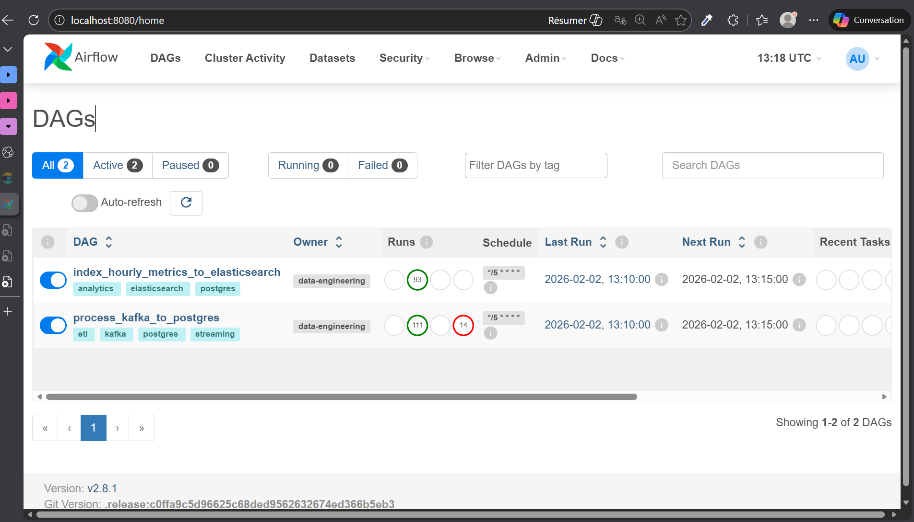
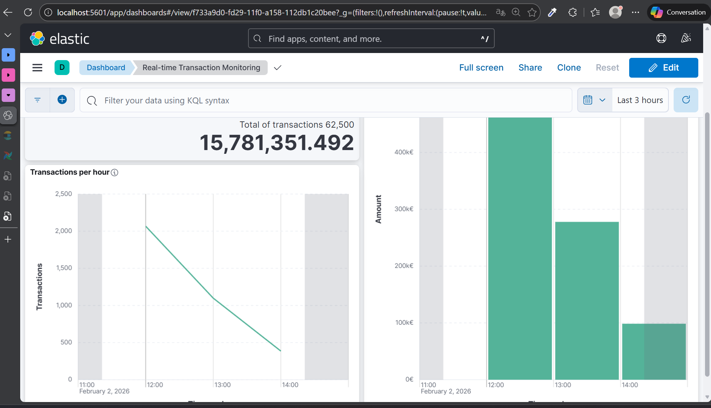

# Real-Time Data Engineering & Observability

## Overview

This project implements an end-to-end **streaming + analytics data pipeline** using:

* **Kafka** for event ingestion
* **PostgreSQL** for storage and SQL transformations
* **Apache Airflow** for orchestration
* **Elasticsearch** for analytics & visualization (via Kibana)

The pipeline consumes transaction events, cleans and enriches them, builds hourly aggregates, and indexes analytics-ready metrics into Elasticsearch.

## Stack
- Python
- Kafka
- Airflow
- PostgreSQL
- Elasticsearch
- Kibana
- Docker

---

## Architecture

```
transactions generated
        ↓
Kafka (transactions topic)
        ↓
PostgreSQL (raw table)
        ↓
Airflow DAG (SQL transformations)
        ↓
PostgreSQL (clean table + analytics view)
        ↓
Elasticsearch (hourly_metrics index)
        ↓
Kibana (metrics visualisation)
```

## 🐳 Infrastructure (Docker)

All components of the data platform run in Docker containers.


---

## Data Model

### Raw table: `transactions`

| Column          | Type      | Description                   |
| --------------- | --------- | ----------------------------- |
| transaction_id  | UUID      | Unique transaction identifier |
| user_id         | UUID      | User identifier               |
| amount          | NUMERIC   | Transaction amount            |
| currency        | TEXT      | Currency code                 |
| status          | TEXT      | Transaction status            |
| event_time      | TIMESTAMP | Event creation time           |
| processing_time | TIMESTAMP | Processing time               |

---

### Clean table: `transactions_clean`

Derived fields:

* `event_date`
* `event_hour`
* `latency_seconds`
* `is_late` (true if latency > 2 minutes)

Indexes are created on:

* `event_time`
* `user_id`
* `is_late`

---

### Analytics view: `hourly_metrics`

| Column             | Description            |
| ------------------ | ---------------------- |
| event_hour         | Hourly bucket          |
| total_transactions | Number of transactions |
| total_amount       | Sum of amounts         |
| late_transactions  | Count of late events   |
| late_ratio         | Late events / total    |

---

## Airflow DAG

**DAG ID:** `process_kafka_to_postgres`

### Schedule

* Default: `@hourly`
* Configurable via `schedule_interval`

**DAG ID:** `index_hourly_metrics_to_elasticsearch`

### Schedule

* Default: `@hourly`
* Configurable via `schedule_interval`

### Pipeline Orchestration (Airflow)

The data pipeline is orchestrated using Apache Airflow.  
Below is the DAG running successfully with all tasks completed.




### Tasks

1. **run_transformations**

   * Rebuilds `transactions_clean`
   * Ensures deterministic, replay-safe transformations

2. **refresh_views**

   * Recreates analytics view `hourly_metrics`

3. **index_hourly_metrics_to_elasticsearch**

   * Reads hourly metrics
   * Indexes data into Elasticsearch
   * Uses `event_hour` as `_id` for idempotency

---

## Idempotency Strategy

* Tables/views are rebuilt deterministically
* Elasticsearch documents use:

```
_id = hour
```
renamed from event_hour

This guarantees:

* No duplicates on DAG re-runs
* Safe backfills
* Stable dashboards

---

## Elasticsearch Index

### Index: `hourly_metrics`

**Mapping:**

* `event_hour` → `date`
* `total_transactions` → `integer`
* `total_amount` → `double`
* `late_transactions` → `integer`
* `late_ratio` → `float`

---

## Use Cases

* Monitor transaction volume per hour
* Detect processing latency issues
* Track late event ratios
* Build Kibana dashboards for real-time analytics

## 📊 Analytics & Monitoring (Kibana)

Aggregated hourly metrics indexed in Elasticsearch and visualized in Kibana.



---

## How to Run

### 1. Start services via Docker Compose
### 2. create table transactions in postgres: 
- windows:
```
Get-Content sql/schema.sql | docker exec -i postgres psql -U admin -d data_pipeline
```
- linux: 
```
docker exec -i postgres psql -U admin -d data_pipeline < sql/schema.sql
```

### 3. manually create airflow user if it is not done during docker compose running:
```
docker exec -it airflow-webserver bash
```
```
airflow users create \
  --username admin \
  --password admin \
  --firstname Admin \
  --lastname User \
  --role Admin \
  --email admin@example.com
```

### 4. Log in airflow web page as admin and create Postgres connection on airflow:
| field     | Value            |
| --------- | ---------------- |
| Conn Id   | postgres_default |
| Conn Type | Postgres         |
| Host      | postgres         |
| Database  | data_pipeline    |
| Login     | admin            |
| Password  | admin            |
| Port      | 5432             |

### 5. Verify:

   * Tables in PostgreSQL (requests in ./sql/analytics.sql)
   * Documents in Elasticsearch
   * Dashboards in Kibana (json to import is present in folder dashboard)

---

## Key Engineering Concepts Demonstrated

* Event-driven architecture
* SQL-based transformations
* Airflow orchestration
* Idempotent pipelines
* Analytics indexing in Elasticsearch

---

## Future Improvements

* Index Lifecycle Management (ILM)
* Schema versioning
* Data quality checks
* Late-event alerting

---

## Author

Built as a hands-on Data Engineering project showcasing production-grade patterns.
